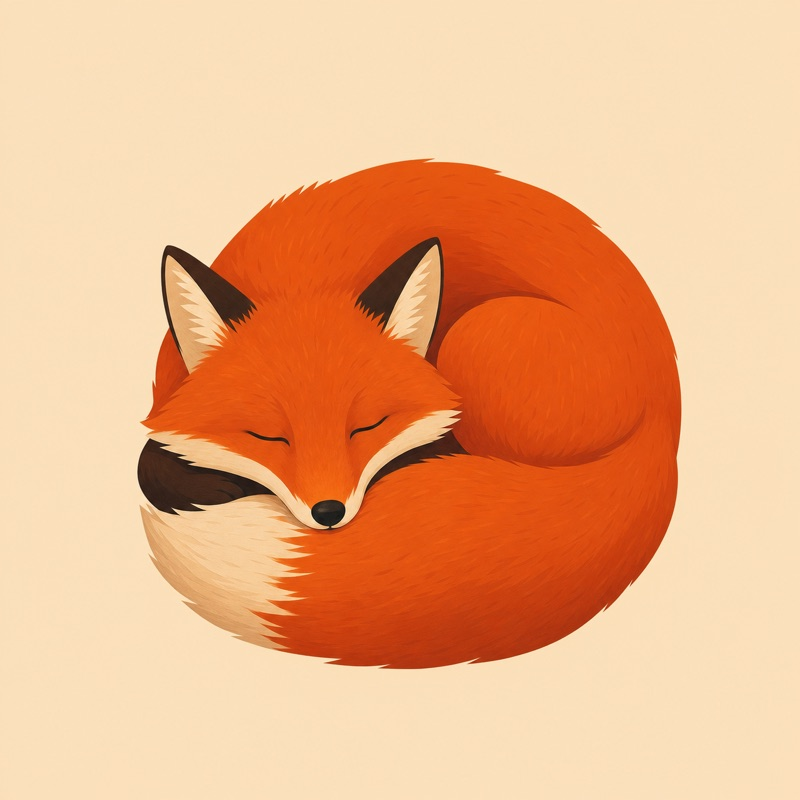
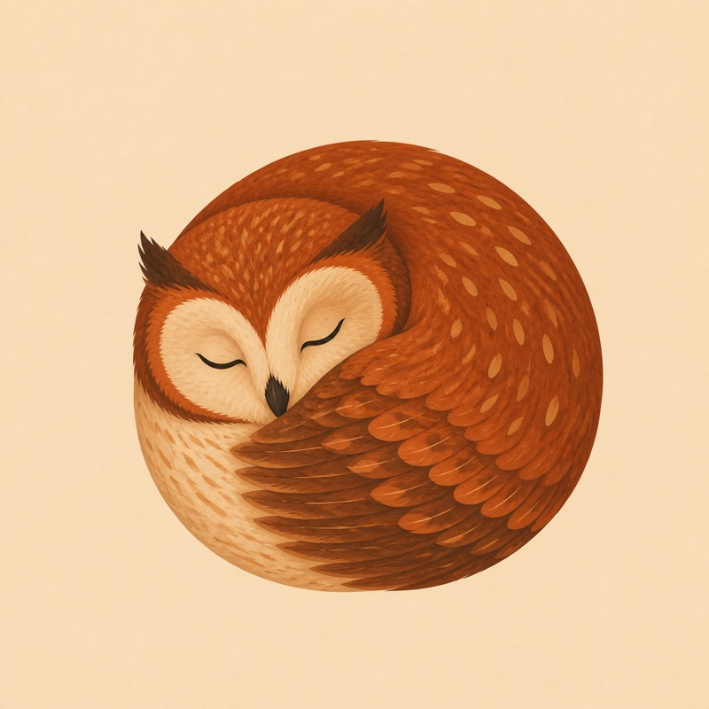

# claude-imagegen

**Image generation for Claude Code.**

Claude Code can't generate images. This skill fixes that by borrowing the image generator
that ships with the **Codex CLI**, so you can ask Claude for a hero image, a social card,
a game sprite, or a mockup, and get a real PNG on disk.

It runs on the ChatGPT plan you already pay for. No `OPENAI_API_KEY`, no per-image
billing, no third-party service.

```
you:     make me a hero image for the landing page
claude:  [asks 2 quick questions, generates, shows you the PNG]
```

---

## What you get

| | |
|---|---|
| **Real files** | PNGs on disk, exactly where you asked for them. |
| **Text that works** | Renders legible text *inside* images, accented languages included. |
| **Format control** | Ask for 16:9, 1080×1350, 4K. It honors it. |
| **Consistency** | Feed a reference image and keep one visual identity across a series. |
| **Transparent PNGs** | `--transparent` gives you a real alpha channel for logos and icons. |
| **A skill that thinks** | Claude asks a couple of sharp questions first, instead of guessing. |

Examples further down.

---

## Requirements (read this part)

**1. A paid ChatGPT plan.** The Codex CLI signs in with a ChatGPT account and supports
Plus, Pro, Business, Edu, or Enterprise. The free tier is *not* supported by Codex login.
(You can use an OpenAI API key instead, but then you're paying per image and this
project's whole point goes away.)

**2. Claude Code.** Obviously.

**3. macOS or Linux.** Windows via WSL should work but is untested.

That's it. No API key to create, no new account to sign up for, no third-party service in
the middle.

---

## Setup, step by step

### Step 1: install the Codex CLI

Pick whichever you prefer:

```bash
# Homebrew (macOS / Linux)
brew install --cask codex

# or npm
npm install -g @openai/codex

# or the install script
curl -fsSL https://chatgpt.com/codex/install.sh | sh
```

Check it worked:

```bash
codex --version
# codex-cli 0.144.2   (any recent version is fine)
```

If you get `command not found`, your shell can't see it yet. Close the terminal, open a
new one, try again.

### Step 2: log in with your ChatGPT account

```bash
codex login
```

This opens your browser. Sign in with the ChatGPT account that has your Plus/Pro plan.
Come back to the terminal when it says you're done.

Verify:

```bash
codex login status
```

### Step 3: install the plugin

Inside Claude Code, run these two:

```
/plugin marketplace add FernandoGomes83/claude-imagegen
/plugin install imagegen@claude-imagegen
```

Nothing to clone, nothing to symlink. Claude Code copies the plugin into its own cache,
so it never depends on a folder you might move or delete.

Later on: `/plugin marketplace update claude-imagegen` to pull updates, and
`/plugin uninstall imagegen@claude-imagegen` to remove it.

<details>
<summary>Not using Claude Code? Install it as a plain skill instead.</summary>

The skill also installs through the [skills.sh](https://www.skills.sh) CLI, which works
across several agents:

```bash
npx skills add FernandoGomes83/claude-imagegen
```

It copies the skill into your agent's skills directory and pins it in a
`skills-lock.json`. Update with `npx skills update`, remove with `npx skills remove`.

For Claude Code specifically, prefer the plugin above: it is the native path and it gets
you versioning, updates, and uninstall for free.

</details>

### Step 4: use it

Open Claude Code and just ask:

```
generate a cover image for my blog post about slow mornings
```

Claude picks up the skill, asks a question or two if the request is thin, generates, and
shows you the result. Each image takes **1 to 2 minutes**.

### Step 5: if something breaks

```bash
codex doctor      # diagnoses your Codex install, auth, and runtime
```

Most problems are Step 2 not actually finishing. Run `codex login status` and confirm.

---

## Using it without Claude

The skill is a thin wrapper over a script, and the script is useful on its own. For that
you do want a clone:

```bash
git clone https://github.com/FernandoGomes83/claude-imagegen.git
cd claude-imagegen

./skills/imagegen/scripts/codex-image.sh \
  --prompt "red fox sleeping curled up, flat minimalist illustration, beige background" \
  --out ~/Desktop/fox.png
```

It prints the absolute path to stdout and nothing else, so it composes:

```bash
open "$(./skills/imagegen/scripts/codex-image.sh -p 'a blue mug' -o /tmp/mug.png)"
```

Long prompt? Put it in a file:

```bash
./skills/imagegen/scripts/codex-image.sh -f prompt.md -o out.png
```

If the file has ``` fences, the first fenced block is used as the prompt, so you can keep
notes and alternatives in the same file.

| Flag | |
|---|---|
| `-p, --prompt` | The image description. |
| `-f, --prompt-file` | Read the prompt from a file (`-` for stdin). |
| `-o, --out` | Where to save. Defaults to `./<slug>-<timestamp>.png`. |
| `--ref` | Reference image for style/composition. Repeatable. |
| `--transparent` | Output a PNG with a real alpha channel. |
| `--key-color` | Chroma key for `--transparent`. Default `#00ff00`. |
| `--model` | Override the Codex model. |
| `--log` / `--keep-log` | Event log control. |

---

## Keeping a consistent look (reference images)

One image is easy. A *series* that looks like it came from the same hand is the hard
part. Pass any image with `--ref` and the generator uses it as visual guidance:

```bash
codex-image.sh --ref fox.png -o owl.png \
  --prompt "an owl sleeping curled up, in EXACTLY the same visual style as the reference:
            same flat minimalist illustration language, same beige background, same warm
            palette, same soft shapes and grain. Only the animal changes. Square, no text."
```

| Reference | Result |
|---|---|
|  |  |

Same background, same palette, same circular composition, same grain. Only the animal
changed.

**The trick is telling it what to keep.** A reference alone drifts. Spell out what stays
(background, palette, shapes, framing) and what changes. Same idea works for people: pass
a photo and ask for that person in a new scene, saying to preserve face and build.

`--ref` is repeatable, so you can combine sources. When you pass more than one, name each
role in the prompt, because the generator reads them by index:

```bash
codex-image.sh --ref style.png --ref layout.png -o out.png \
  --prompt "Image 1: style reference. Image 2: composition reference. ..."
```

Ask in Claude and it works the same way: *"generate an owl in the same style as fox.png"*.

Two things worth knowing:

- **Reference guides, it doesn't clone.** It isn't inpainting or a pixel-faithful edit.
  For that you want the fallback CLI with masks.
- **Negative constraints are not a contract.** Whatever you put on the avoid list can
  still show up, especially when the model has a strong visual cliché for the subject.
  Look at what came out.

---

## Examples

All generated through this skill, unretouched, first try.

| | |
|---|---|
|  | `red fox sleeping curled up, flat minimalist illustration, beige background, no text` |
|  | `blue coffee cup on light wood table, product photography, soft studio light` |
|  | An ads-marketing banner with **verbatim text**, landscape 16:9, negative space on the right third. Text renders clean. |
|  | Accented Portuguese, rendered correctly first try: *"A graça de Deus não é mérito — é presença, perdão e compaixão."* Every accent and the em dash landed right. |

---

## How it works

```
Claude Code  ──►  codex-image.sh  ──►  codex exec (headless)  ──►  image_gen
                                                                      │
     Read  ◄──────  /your/path.png  ◄─────────────────────────────────┘
```

The skill shells out to `codex exec`, Codex runs its built-in `image_gen` tool, and the
PNG lands at the path you named. Claude then reads that file to actually *look* at the
result.

**The one non-obvious trick:** you have to name the destination path inside the prompt.
Codex's imagegen skill treats an unnamed-destination request as *preview-only* and
"renders it inline", which doesn't exist in a headless run. Without a dictated path, the
run exits **0**, prints an empty message, and writes **no file at all**. Silent failure.

So the script dictates the output path and then verifies the file on disk. It never
trusts the exit code or the model's answer. The file is the source of truth.

---

## Limitations

- **1 to 2 minutes per image.** It's not instant. Nothing to be done about that.
- **Aspect ratio is honored, not guaranteed.** There's no size flag on the built-in tool.
  If you need exactly 1200×630, verify and resize.
- **Transparency** works through `--transparent`, which keys out a chroma background
  locally. Great for logos, icons and product cutouts. Hair, fur, smoke and glass key
  badly, and there it fails loudly instead of returning a bad cutout.
- **Editing existing images** is limited. `--ref` guides style. It isn't inpainting.
- **Text is the fragile part.** It's very good, but always look at the result. Long copy
  raises the risk.

---

## FAQ

**Does this cost anything per image?**
No. It uses the Codex CLI on your existing ChatGPT plan. There's no API key and no
metered billing. Your plan's usage limits still apply.

**Does it work on the free ChatGPT tier?**
No. Codex login supports Plus, Pro, Business, Edu, and Enterprise. That's OpenAI's
requirement, not this project's.

**Does it send my code to OpenAI?**
It sends your *prompt* to Codex, same as any Codex run. It doesn't read your repo to
build the prompt.

**Why not just use an image API?**
You can. Codex ships a fallback CLI for that, and it needs `OPENAI_API_KEY` plus
per-image billing. This project exists to avoid exactly that.

**Windows?**
Untested. WSL should be fine. PRs welcome.

---

## License

MIT, see [LICENSE](LICENSE).

Built by [@FernandoGomes83](https://github.com/FernandoGomes83).
